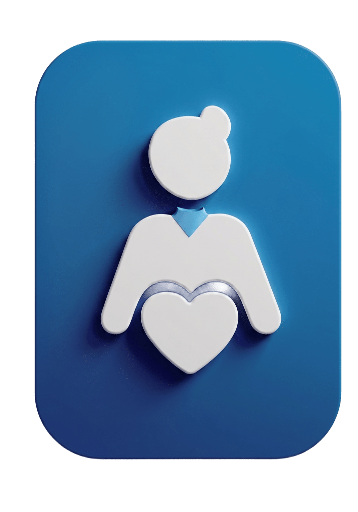

# Kids Clinic Management System

<div align="center">
  
</div>

A comprehensive, production-ready system designed specifically for pediatric clinics to seamlessly manage kids profiles, reservations, medical consultations, vaccines, and financial accounts.

## 🚀 Features

* **Dashboard & Analytics:** Global search and quick overview of clinic operations.
* **Kids Management:** Maintain detailed profiles for every child.
* **Reservations:** Schedule and track clinic appointments effortlessly.
* **Medical Consultations:** Keep historical logs of medical visits and diagnoses.
* **Vaccination Tracking:** Monitor immunization records for patients.
* **Account Management:** Track finances, bills, and payments.
* **User & Role Management:** Built-in admin dashboard for staff access control.

## 🛠️ Technology Stack

This project is built using a modern, robust, and lightweight stack:

* **Backend:** PHP 8.x, Laravel Framework
* **Database:** MySQL
* **Frontend:** HTML, Vanilla CSS, Bootstrap & Tailwind CSS (via CDN)
* **Architecture:** 100% Native PHP dependencies (No Node.js or NPM required to run!)

---

## 📖 Installation & Setup

We have prepared a dedicated, step-by-step setup guide for running this project on Windows machines using XAMPP.

👉 **Please refer to the setup guide here: [WINDOWS_SETUP.md](./WINDOWS_SETUP.md)**

### Quick Start (Overview)
1. Install XAMPP and Composer.
2. Clone or extract this repository.
3. Open terminal in the project folder and run:
   ```bash
   composer install
   copy .env.example .env
   php artisan key:generate
   php artisan migrate
   php artisan serve
   ```
4. Access the system at `http://127.0.0.1:8000`

## 🔒 Default Credentials

For testing purposes during development, you can use the following credentials to access the system:

* **Username:** `zackriver`
* **Password:** `password`

## 📝 License

This project is proprietary and intended for private use by the authorized clinic administration.
